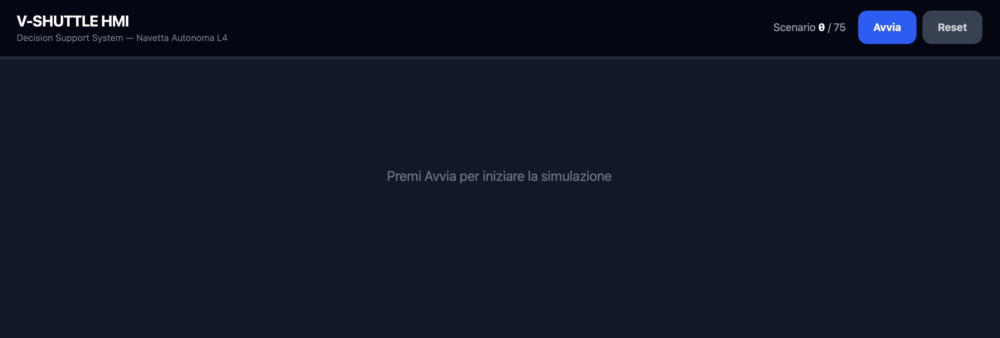
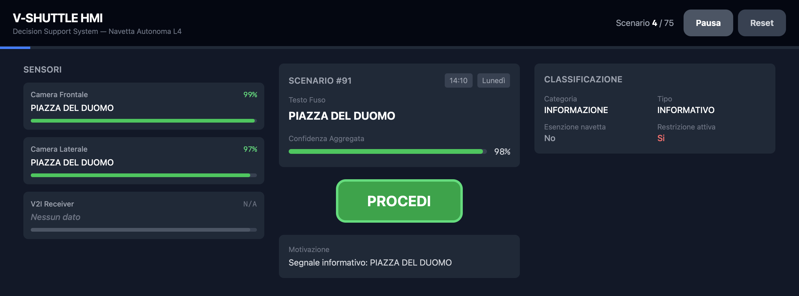
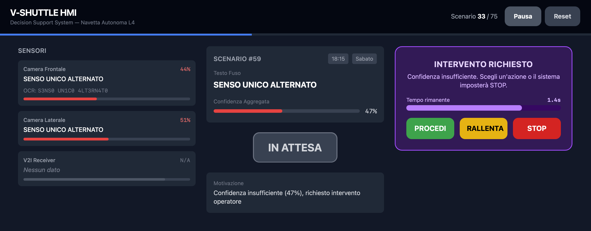
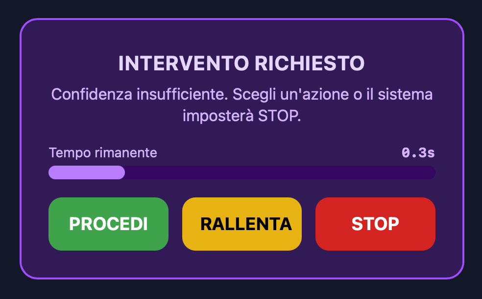

# V-SHUTTLE HMI -- Architettura e Dettagli Implementativi

## 1. Panoramica del Progetto

V-SHUTTLE HMI è un **Decision Support System** progettato per navette autonome di Livello 4 destinate alla circolazione nei centri storici toscani. L'obiettivo principale è eliminare il fenomeno del **"Phantom Braking"** (frenate d'emergenza non necessarie) fornendo al Safety Driver una dashboard decisionale chiara, alimentata da un motore di fusione sensoriale deterministico.

Il sistema è interamente client-side: tutta la logica gira nel browser, senza backend, senza database e senza chiamate a servizi esterni o LLM.

E' possibile tuttavia accedere all'applicazione al seguente link: https://team-numero5-v-shuttle.vercel.app/

---

## 2. Il Team

| Membro | Area di responsabilità | Testing |
|--------|----------------------|---------|
| **Alberto Capellini** | Data Fusion Engine (`src/core/fusion/`) | Test unitari Fusion (`fusion.test.ts`) |
| **Tommaso Ammannati** | Semantic Parser (`src/core/parser/`) | Test unitari Parser (`parser.test.ts`) |
| **Matteo Bozzi** | Interfaccia Utente (`src/components/`, `src/hooks/`) | Test unitari UI |

I test di integrazione end-to-end sono stati progettati e sviluppati in collaborazione da tutti e tre i membri del team.

---

## 3. Approccio e Metodologia

### Analisi dei Requisiti

Ci siamo avvalsi di Gemini come supporto per stilare un'analisi dei requisiti strutturata, applicando due framework complementari:

- **Principio di Pareto (80/20)**: per identificare il 20% delle funzionalità in grado di coprire l'80% del valore richiesto, concentrando lo sforzo sulle aree a maggiore impatto.
- **Metodo MoSCoW** (Must have, Should have, Could have, Won't have): per prioritizzare i requisiti in modo chiaro e condiviso.

### Definizione delle Interfacce Comuni

Prima di avviare lo sviluppo del backend, il team ha definito le **interfacce comuni** nel file `src/core/types.ts`. Questo passaggio è stato fondamentale: senza un contratto condiviso tra i moduli, il motore di Fusion sviluppato da Alberto non sarebbe stato compatibile con il Parser di Tommaso, né con la UI di Matteo. L'adozione di un'unica fonte di verità per i tipi ha permesso a ciascun membro di lavorare in parallelo sulla propria area, garantendo l'interoperabilità fin dall'inizio.

---

## 4. Stack Tecnologico

| Livello | Tecnologia | Versione |
|---------|-----------|----------|
| Linguaggio | TypeScript (Strict Mode) | 5.9.3 |
| Framework UI | React | 19.2.4 |
| Build Tool | Vite | 7.3.1 |
| CSS | Tailwind CSS (v4, plugin Vite) | 4.2.1 |
| Test | Vitest | 4.0.18 |
| IDE | VS Code + GitHub Copilot (Claude) | Opus 4.6 |
| AI supporto progettazione | Google Gemini | 3 Pro |

Gemini 3 Pro è stato utilizzato nelle fasi iniziali del processo software come supporto alla progettazione dell'architettura e all'analisi dei requisiti. 
VS Code con GitHub Copilot (modello Claude Opus 4.6) è stato impiegato durante lo sviluppo per accelerare la scrittura di componenti boilerplate.

---

## 5. Struttura del Progetto

```
Hackaton-Hastega-9-3-2026/
├── data/
│   └── VShuttle-input.json          # 73 scenari di guida (JSON array)
├── dist/                             # Build di produzione pre-generata
│   ├── index.html
│   └── assets/
│       ├── index-DN4datpw.css
│       └── index-esB0Fes0.js
├── src/
│   ├── main.tsx                      # Entry point React
│   ├── App.tsx                       # Componente root, carica gli scenari
│   ├── index.css                     # Import Tailwind CSS
│   ├── core/
│   │   ├── types.ts                  # Interfacce, tipi e costanti condivise
│   │   ├── fusion/                   # Motore di Fusione Dati
│   │   │   ├── index.ts             # Orchestratore: processScenario()
│   │   │   ├── normalizer.ts        # Pipeline di normalizzazione OCR
│   │   │   ├── weightedFusion.ts    # Selezione testo pesata + calcolo confidenza
│   │   │   ├── confidenceScoring.ts # Valutazione confidenza + trigger intervento umano
│   │   │   └── fusion.test.ts       # 16 test unitari
│   │   └── parser/                   # Parser Semantico
│   │       ├── index.ts             # Orchestratore: parseScenario()
│   │       ├── logicMapping.ts      # Classificazione segnali + estrazione eccezioni/orari
│   │       ├── vehicleAwareness.ts  # Logica esenzioni veicolo
│   │       ├── temporalCheck.ts     # Verifica vincoli temporali (orario e giorno)
│   │       └── parser.test.ts       # 56 test unitari
│   ├── hooks/
│   │   └── useSimulation.ts          # Hook React: loop simulazione con timer
│   └── components/
│       ├── Dashboard.tsx             # Layout principale della dashboard
│       ├── ScenarioView.tsx          # Vista dettaglio scenario (layout 3 colonne)
│       ├── SensorPanel.tsx           # Visualizzazione letture sensori individuali
│       ├── DecisionBadge.tsx         # Badge decisione con codice colore
│       └── HumanOverride.tsx         # Pannello override umano con countdown
├── index.html                        # Entry point HTML (Vite SPA)
├── package.json                      # Configurazione NPM
├── tsconfig.json                     # Configurazione TypeScript
├── vite.config.ts                    # Configurazione Vite (React + Tailwind)
├── vitest.config.ts                  # Configurazione Vitest
└── VShuttle-input.json               # Copia root dei dati scenario
```

---

## 6. Architettura a Pipeline a 3 Stadi

Il cuore del sistema segue una pipeline sequenziale rigida:

```
Dati Sensori Grezzi (JSON)
        │
        ▼
┌─────────────────────┐
│  DATA FUSION ENGINE  │  Normalizzazione OCR → Selezione testo pesata → Valutazione confidenza
└─────────────────────┘
        │
        ▼
    FusionResult
        │
        ▼
┌─────────────────────┐
│   SEMANTIC PARSER    │  Classificazione segnale → Esenzioni veicolo → Vincoli temporali → Decisione
└─────────────────────┘
        │
        ▼
    ParserResult
        │
        ▼
┌─────────────────────┐
│    UI DASHBOARD      │  Visualizzazione risultati + Intervento umano
└─────────────────────┘
```

---

## 7. Dati di Input

### 7.1 Formato degli Scenari (`data/VShuttle-input.json`)

Array JSON di 73 scenari di guida. Ogni scenario contiene:

- **`id_scenario`**: identificativo intero univoco
- **`sensori`**: oggetto con 3 letture sensoriali:
  - `camera_frontale`: lettura OCR della camera frontale (`testo`: string|null, `confidenza`: number|null)
  - `camera_laterale`: lettura OCR della camera laterale
  - `V2I_receiver`: lettura del ricevitore Vehicle-to-Infrastructure
- **`orario_rilevamento`**: orario di rilevamento in formato "HH:MM"
- **`giorno_settimana`**: giorno della settimana in italiano

Gli scenari coprono una vasta gamma di segnaletica stradale italiana (ZTL, divieti di transito, limiti di velocità, aree pedonali, lavori in corso, ecc.) e includono diverse forme di corruzione OCR.

---

## 8. Tipi e Costanti Condivise (`src/core/types.ts`)

Questo file è la **singola fonte di verità** per tutte le interfacce del sistema.

### 8.1 Interfacce Principali

- **`SensorReading`**: lettura grezza di un sensore (`testo`, `confidenza`)
- **`SensorSet`**: tripletta di sensori (camera_frontale, camera_laterale, V2I_receiver)
- **`Scenario`**: struttura di uno scenario di input (corrisponde allo schema JSON)
- **`NormalizedReading`**: lettura post-pulizia OCR
- **`FusionResult`**: output del Data Fusion Engine (testo fuso, confidenza, necessità intervento)
- **`ParsedSign`**: segnale completamente classificato (categoria, tipo, eccezioni, vincoli temporali)
- **`ParserResult`**: output completo del parser (segnale, decisione, motivazione)

### 8.2 Tipi Enumerativi

- **`SignCategory`**: `DIVIETO` | `OBBLIGO` | `PERICOLO` | `INFORMAZIONE`
- **`SignType`**: 15 sottotipi specifici (TRANSITO, ACCESSO, SOSTA, ZTL, SENSO_VIETATO, AREA_PEDONALE, STRADA_CHIUSA, VELOCITA, RALLENTARE, GENERICO, ecc.)
- **`ExceptionType`**: 10 eccezioni riconosciute (BUS, BUS_TAXI, NAVETTE_L4, VEICOLI_ELETTRICI, RESIDENTI, MEZZI_DI_SOCCORSO, FORNITORI, AUTORIZZATI, MEZZI_PESANTI, VEICOLI_A_MOTORE)
- **`Decision`**: `PROCEDI` | `STOP` | `RALLENTA` | `INTERVENTO_UMANO`

### 8.3 Costanti

- **`VEHICLE_PROPERTIES`**: il veicolo è classificato come BUS, NavettaL4, elettrico e autorizzato (ma NON taxi, residente, mezzo di soccorso, fornitore o mezzo pesante)
- **`CONFIDENCE_THRESHOLD`**: `0.60` -- sotto questa soglia scatta l'intervento umano
- **`DEFAULT_WEIGHTS`**: camera_frontale = 0.50, camera_laterale = 0.30, V2I_receiver = 0.20

---

## 9. Data Fusion Engine (`src/core/fusion/`)

### 9.1 Pipeline di Normalizzazione OCR (`normalizer.ts`)

La normalizzazione del testo OCR avviene in 6 passi sequenziali:

1. **Conversione a maiuscolo**: uniforma tutto il testo
2. **Rimozione spaziatura caratteri** (`removeCharSpacing`): trasforma `D I V I E T O` in `DIVIETO`. L'algoritmo divide su 2+ spazi per separare le parole, poi compatta le sequenze di singoli caratteri separati da singoli spazi
3. **Rimozione separatori a punto** (`removeDotSeparators`): trasforma `V.A.R.C.O.` in `VARCO`
4. **Normalizzazione range orari** (`normalizeTimeRanges`): trasforma `08:00 20:00` in `08:00-20:00`
5. **De-leetificazione** (`deleetify`): inverte la sostituzione leet-speak (`0→O`, `1→I`, `3→E`, `4→A`, `5→S`), preservando numeri puri e pattern orari (es. `D1V1ET0` diventa `DIVIETO`, ma `30` resta `30`)
6. **Collasso spazi** (`collapseSpaces`): rimuove spazi multipli e trim

### 9.2 Selezione Testo Pesata (`weightedFusion.ts`)

- **`selectBestText()`**: raggruppa le letture normalizzate per testo identico, calcola lo score pesato per ogni gruppo (`peso_sensore × confidenza`), seleziona il candidato con il punteggio totale più alto
- **`computeWeightedConfidence()`**: calcola la media pesata della confidenza su tutti i sensori attivi: `SUM(peso_i × confidenza_i) / SUM(pesi_attivi)`

### 9.3 Valutazione Confidenza (`confidenceScoring.ts`)

- **`assessConfidence()`**: calcola la confidenza complessiva, conta sensori attivi e sensori in accordo, determina se l'intervento umano è necessario (confidenza < 0.60 oppure nessun sensore attivo)

### 9.4 Orchestratore Fusione (`index.ts`)

- **`processScenario()`**: esegue la pipeline in 3 passi: normalizzazione → selezione testo migliore → valutazione confidenza
- **`processAllScenarios()`**: elaborazione batch di tutti gli scenari

---

## 10. Semantic Parser (`src/core/parser/`)

### 10.1 Classificazione Segnaletica (`logicMapping.ts`)

Il file più complesso del progetto. Effettua la classificazione deterministica tramite pattern regex.

**`classifySign()`** classifica il testo in categoria e tipo specifico con la seguente priorità:

1. **ZTL** → categoria DIVIETO, tipo ZTL
2. **DIVIETO DI...** → sottotipi TRANSITO, ACCESSO, SOSTA, FERMATA, AFFISSIONE, SCARICO
3. **STRADA CHIUSA** → DIVIETO / STRADA_CHIUSA
4. **AREA PEDONALE** → DIVIETO / AREA_PEDONALE
5. **OBBLIGO** → categoria OBBLIGO
6. **ZONA 30 / LIMITE** → OBBLIGO / VELOCITA
7. **RALLENTARE** → PERICOLO / RALLENTARE
8. **PERICOLO / LAVORI / DOSSO** → PERICOLO / sottotipo specifico
9. **SENSO UNICO** → INFORMAZIONE / SENSO_UNICO
10. **ROTATORIA** → OBBLIGO / ROTATORIA
11. **Eccezioni standalone** → DIVIETO / TRANSITO
12. **Accesso informativo** → INFORMAZIONE / ACCESSO
13. **Fallback generico** → INFORMAZIONE / NON_RILEVANTE

**`extractExceptions()`** estrae le esenzioni veicolo dal testo:
- `ECCETTO BUS`, `ECCETTO BUS E TAXI`, `NAVETTE L4`, `VEICOLI ELETTRICI`, `RESIDENTI`, `MEZZI DI SOCCORSO`, `FORNITORI`, `AUTORIZZATI`, `MEZZI PESANTI`, `VEICOLI A MOTORE`

**`extractTimeConstraint()`** riconosce range orari in formati multipli:
- `HH:MM-HH:MM`, `HH-HH` (abbreviato), `DALLE HH:MM ALLE HH:MM`, singolo orario di inizio

**`extractDayConstraint()`** riconosce:
- Range settimanali (`LUN-VEN`), festivi (`FESTIVI`), giorni singoli

**`parseSign()`** restituisce un `ParsedSign` completo, inclusi i flag `isExplicitlyInactive` (VARCO NON ATTIVO, FINE ZTL) e `isAlwaysActive` (0-24, SEMPRE).

### 10.2 Logica Esenzioni Veicolo (`vehicleAwareness.ts`)

**`isVehicleExempt()`** mappa ogni tipo di eccezione a una proprietà del veicolo:

| Eccezione | Esente? | Motivazione |
|-----------|---------|-------------|
| BUS | Si | Il veicolo è un BUS |
| BUS_TAXI | Si | Il veicolo è un BUS |
| NAVETTE_L4 | Si | Il veicolo è una Navetta L4 |
| VEICOLI_ELETTRICI | Si | Il veicolo è elettrico |
| AUTORIZZATI | Si | Il veicolo è autorizzato |
| RESIDENTI | No | Il veicolo non è un residente |
| MEZZI_DI_SOCCORSO | No | Il veicolo non è un mezzo di soccorso |
| FORNITORI | No | Il veicolo non è un fornitore |
| MEZZI_PESANTI | Si | Il veicolo NON è un mezzo pesante (quindi non soggetto al divieto) |

### 10.3 Verifica Vincoli Temporali (`temporalCheck.ts`)

**`isTemporallyActive()`** verifica se una restrizione è attiva al dato orario e giorno:

1. Se il segnale è **esplicitamente inattivo** → sempre `false`
2. Se il segnale è **sempre attivo** (0-24, SEMPRE) → sempre `true`
3. Verifica **range orario**, inclusi range notturni (es. 22:00-06:00)
4. Verifica **vincoli giornalieri** (giorni della settimana, festivi)
5. Default: **attivo** se non ci sono vincoli temporali

### 10.4 Orchestratore Parser (`index.ts`)

**`parseScenario()`** esegue la pipeline completa:

1. Se la fusione richiede intervento umano → decisione `INTERVENTO_UMANO`
2. Se non c'è testo fuso → decisione `INTERVENTO_UMANO`
3. **Logic Mapping** → classifica il segnale
4. **Vehicle Awareness** → verifica esenzioni
5. **Temporal Check** → verifica vincoli temporali

**`computeDecision()`** implementa la logica decisionale finale:

| Condizione | Decisione |
|------------|-----------|
| Segnale esplicitamente inattivo | PROCEDI |
| Tipo NON_RILEVANTE | PROCEDI |
| Categoria INFORMAZIONE | PROCEDI |
| Categoria OBBLIGO | RALLENTA |
| Categoria PERICOLO | RALLENTA |
| Divieti SOSTA/FERMATA | PROCEDI (non bloccano il transito) |
| Divieti bloccanti (TRANSITO, ACCESSO, ZTL, SENSO_VIETATO, AREA_PEDONALE, STRADA_CHIUSA) + veicolo esente | PROCEDI |
| Divieti bloccanti + temporalmente inattivi | PROCEDI |
| Divieti bloccanti attivi, veicolo non esente | STOP |
| Fallback | RALLENTA |

---

## 11. Interfaccia Utente (React)

### 11.1 Entry Point (`main.tsx`, `App.tsx`)

- `main.tsx` crea il root React e renderizza `<App />` in StrictMode
- `App.tsx` importa i dati degli scenari dal JSON, li tipizza come `Scenario[]` e li passa a `<Dashboard>`

### 11.2 Hook di Simulazione (`hooks/useSimulation.ts`)

Gestisce l'intero ciclo di vita della simulazione:

- **Costanti**: `SCENARIO_INTERVAL_MS = 4000` (4 secondi per scenario), `HUMAN_OVERRIDE_MS = 2000` (2 secondi per override)
- **`processAndShow()`**: elabora uno scenario attraverso fusione + parser, poi avanza automaticamente dopo 4 secondi oppure avvia il countdown di 2 secondi per l'override umano
- **`humanOverride()`**: consente la sovrascrittura manuale della decisione (PROCEDI/STOP/RALLENTA)
- **Safety Fallback**: se il timer di 2 secondi scade senza intervento, la decisione viene impostata automaticamente a **STOP** (design safety-first)
- **Controlli**: `start()`, `stop()`, `reset()`, con pulizia timer su unmount

### 11.3 Componenti UI

#### Dashboard (`Dashboard.tsx`)
- Layout full-screen dark mode (bg-gray-900)
- Header: titolo "V-SHUTTLE HMI" con sottotitolo
- Indicatore di progresso: contatore scenario e barra di avanzamento
- Pulsanti di controllo: "Avvia"/"Riprendi", "Pausa", "Reset" (minimo 44×44px, conforme al requisito Fat Finger)

#### ScenarioView (`ScenarioView.tsx`)
Layout a 3 colonne responsive (1 colonna su mobile, 3 colonne su desktop):

- **Colonna sinistra**: `SensorPanel` con letture individuali dei sensori
- **Colonna centrale**: info scenario (ID, orario, giorno), testo fuso, barra confidenza (verde >80%, giallo >60%, rosso <60%), badge decisione grande, motivazione della decisione
- **Colonna destra**: pannello `HumanOverride` (quando attivo), dettagli classificazione segnale (categoria, tipo, stato esenzione veicolo, attività temporale, eccezioni)

#### SensorPanel (`SensorPanel.tsx`)
- Card per ciascuno dei 3 sensori
- Mostra: nome sensore, percentuale confidenza, testo normalizzato, testo OCR originale (se diverso), barra confidenza colorata

#### DecisionBadge (`DecisionBadge.tsx`)
Badge con codice colore su 4 stati + stato di attesa:

| Decisione | Colore | Testo |
|-----------|--------|-------|
| PROCEDI | Verde | Bianco |
| RALLENTA | Giallo | Nero |
| STOP | Rosso | Bianco |
| INTERVENTO_UMANO | Viola | Bianco |
| null | Grigio | "IN ATTESA" |

Supporta varianti `large` e `small`.

#### HumanOverride (`HumanOverride.tsx`)
- Pannello viola con animazione pulsante
- Barra countdown (massimo 2 secondi)
- Tre pulsanti Fat Finger (44×44px min): PROCEDI (verde), RALLENTA (giallo), STOP (rosso)
- Informa l'operatore che la confidenza è insufficiente e che è richiesta una decisione

---

## 12. Preview Visiva

Questa sezione offre alla giuria un percorso visivo guidato attraverso l'interfaccia del sistema. Ogni screenshot evidenzia un aspetto chiave del flusso decisionale.

### 12.1 Dashboard principale — stato di attesa

> **Cosa osservare:** il layout a schermo intero in dark mode, la barra di progresso degli scenari (ancora grigia, subito sotto la "navbar" nera), i pulsanti di controllo simulazione (Avvia / Pausa / Reset) conformi al requisito Fat Finger (44×44 px). Notare come l'interfaccia comunichi chiaramente lo stato "IN ATTESA" prima dell'avvio.

### 12.2 Scenario in elaborazione — decisione automatica


> **Cosa osservare:** il layout a 3 colonne: a sinistra le letture dei singoli sensori con il testo OCR originale e quello normalizzato; al centro il testo fuso, la barra di confidenza (verde = alta affidabilità) e il badge decisionale; a destra i dettagli di classificazione del segnale (categoria, tipo, esenzioni, stato temporale). Questa vista dimostra come la pipeline Fusion → Parser → UI produca una decisione chiara e motivata.

### 12.3 Intervento umano — confidenza insufficiente



> **Cosa osservare:** il pannello viola con animazione pulsante che segnala la necessità di intervento umano, la barra di countdown di 2 secondi e i tre pulsanti PROCEDI / RALLENTA / STOP. Questo è il momento critico del design safety-first: se il Safety Driver non interviene entro il timeout, il sistema esegue automaticamente uno STOP.

### 12.4 Validazione end-to-end

Ogni stato visibile negli screenshot è il risultato diretto della pipeline deterministica testata da **72 test unitari e di integrazione**. In particolare:

- I dati mostrati nel pannello sensori sono prodotti dal **Data Fusion Engine**, coperto da 16 test unitari che verificano normalizzazione OCR, selezione pesata e valutazione di confidenza.
- La decisione e la classificazione visualizzate al centro e a destra derivano dal **Semantic Parser**, validato da 56 test che coprono tutti i 15 tipi di segnale, le 10 eccezioni veicolo e i vincoli temporali.
- I **24 test di integrazione end-to-end**, sviluppati collettivamente dal team, garantiscono che l'intero percorso — dal JSON grezzo alla decisione finale — sia coerente e privo di regressioni.

Ciò che la giuria osserva nell'interfaccia non è una semplice visualizzazione: è l'output verificato di un motore a regole interamente coperto da test automatizzati.

---

## 13. Pattern Architetturali

### 13.1 Motore a Regole Deterministico
Tutta la logica decisionale è implementata con funzioni pure e pattern matching basato su regex. Non ci sono chiamate API esterne, machine learning o comportamenti non deterministici.

### 13.2 Fusione Sensoriale Pesata
I sensori sono pesati per affidabilità: Camera Frontale (50%), Camera Laterale (30%), V2I (20%). La fusione seleziona la variante testuale con lo score pesato più alto, gestendo le situazioni di disaccordo tra sensori.

### 13.3 Human-in-the-Loop con Safety Fallback
Quando la confidenza scende sotto il 60%, il sistema entra in un countdown di 2 secondi durante il quale l'operatore può sovrascrivere la decisione. Se non viene intrapresa alcuna azione, il sistema esegue automaticamente uno **STOP** (principio di sicurezza).

### 13.4 Separazione delle Responsabilità
- `src/core/` contiene tutta la logica di business (TypeScript puro, nessuna dipendenza React)
- `src/components/` contiene solo la renderizzazione UI
- `src/hooks/` fa da ponte tra i due livelli tramite React hooks
- `src/core/types.ts` è la singola fonte di verità per tutte le interfacce

### 13.5 Design UI Fat Finger
Tutti gli elementi interattivi mantengono un target di tocco minimo di 44×44px, progettato per tablet da 12 pollici utilizzati nella cabina della navetta.

---

## 14. Testing

Il progetto include **72 test unitari** suddivisi in due file:

### `fusion.test.ts` (16 test)
- Normalizzazione OCR: gestione null, conversione leet-speak, rimozione spaziatura, rimozione punti, normalizzazione orari
- Selezione testo: gestione tutti null, selezione per consenso, preferenza per score pesato
- Confidenza pesata: dati nulli, calcolo completo, esclusione sensori null
- Valutazione confidenza: intervento senza dati, alta confidenza, bassa confidenza
- **Test di integrazione**: scenari con sensori concordanti, corruzione OCR, sensori tutti null, spaziatura caratteri, ZTL con range orari

### `parser.test.ts` (56 test)
- Classificazione segnali: tutti i 15 tipi
- Estrazione eccezioni: tutte le 10 eccezioni
- Vincoli temporali: tutti i formati orario
- Vincoli giornalieri: range, festivi, singoli giorni
- Esenzioni veicolo: tutti i casi
- Attività temporale: varco inattivo, sempre attivo, range diurni/notturni
- **24 test di integrazione end-to-end** che coprono tutti i percorsi decisionali

---

## 15. Build e Deployment

| Comando | Descrizione |
|---------|-------------|
| `npm run dev` | Avvia il dev server Vite |
| `npm run build` | Compilazione TypeScript + build produzione Vite → `/dist/` |
| `npm run preview` | Serve la build da `/dist/` |
| `npm test` | Esegue i 72 test con Vitest |
| `npm run test:watch` | Esegue i test in modalità watch |

La directory `/dist/` è pre-committata nel repository per deployment immediato.

---

## 16. Configurazione TypeScript

Il progetto adotta TypeScript in **strict mode** con controlli aggiuntivi di sicurezza:
- `noUnusedLocals`: errore per variabili locali non utilizzate
- `noUnusedParameters`: errore per parametri non utilizzati
- `noFallthroughCasesInSwitch`: errore per fallthrough nei case degli switch
- `noUncheckedIndexedAccess`: forza il check di undefined sugli accessi per indice
- Path alias: `@/*` → `src/*`
